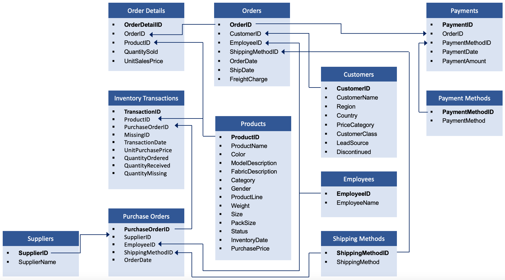

# Final Proyect - Retail

## Objetive 

The objective is to predict the demand for products in a shop to optimise inventory levels and reduce losses due to overstocking or out-of-stocks. In addition, to link the demand for these products with the optimisation of the distribution of these products in the warehouse to optimise the preparation/stocking time and maximise sales. 

**Use Cases**
- Improve stock management.
- Reduce losses due to unsold products
- Predict demand in high sales seasons (Christmas, Sales, Holidays) 

## Data Sources

[Kaggle dataset] (https://www.kaggle.com/datasets/hserdaraltan/underwear-data-with-11-tables-and-up-to-100k-rows?select=products.csv)

## Insights

**Customer**
- Los clientes proceden en su mayoría de Rusia, sobre todo de la región de Moscow (27.6%)
- Los clientes se caracterizan por ser discontinuos o no, siendo continuos más del 80% --> por tanto, podemos decir que se trata de una empresa de la que "se suele fiar"
- La captación de clientes se realiza sobre todo a través de anuncios o llamadas y visitas
- Los clientes son sobre todo retail o mayoristas a pequeña escala

- ¿Cuánto gastan en promedio? --> Pendiente
- Segmentar clientes para ofrecerles estrategias personalizadas --> Pendientes
- Sacar un mapa de clientes con los productos más vendidos, cantidad, etc

**Delay Payments**
- Los clientes tardan una media de 4 días en pagar.
- No existe una correlación entre la cantidad de dinero vendida con los días de retraso en el pago
- Se observa que en media los clientes que pagan por adelantado gastan más que los que pagan días tarde (sobre todo, cuando son mñas de 30 días)
- En particular, las características de los clientes que pagan con retraso son: 
    - Region: Moscú
    - Price Category: 1
    - Customer Class: Large-Scale Wholesaler-1 
    - Lead Source: Referral by the Central Office
    - Discontinued: No

- La tendencia entre el incremento de retraso de pagos y el total de ventas es contraria a lo largo del tiempo, es decir, cuando hay un pico de ventas, suele haber un pico en el número de días de retraso

**DeliveryTime**

- En media es 0, podemos decir que es una empresa eficiente
- No se pueden sacar conclusiones por el medio de transporte

**Sales**

- Las ventas son mayores en Moscu,
- Las ventas y la cnatidad de clientes está muy relacionada
- La frecuencia de pedidos por clientes es 10
- La fuente de clientes más rentable es *Advertisement in National Wholesale Magazine* por el número de pedidos y el capital generado
- El coste de entrega con respecto a las ventas es menor del 0.05
- Total de Ventas = 3953248.07
- Los productos que más ingresos generan pertenecen a la categoría de *Briefs* y *Drawers*
- Productos más vendidos son a su vez los mismos que los que más ingresos generan.
- Las categorías que más margen de beneficio dejan son 
    - *Cuff-Over the Calf* --> 43.57%, pero son los que menos se han vendido
    - *Regular-Over the Calf* --> 43.07%, solo se han vendido un poco más de 3100

Después, vemos también que: 
    - *Briefs* --> 28.56%, a pesar de ser nuestra categoria más vendida y que más ingresos generan no es la que más beneficios ofrece
    - Después podemos potenciar ventas de otros productos con mayor rentabilidad, puesto que se venden bastante como: *Thongs* (35.29%) y *Undershits* (35.21%)

Productos que más margen de beneficios generan: 
    -  3066	S-TIEE03S	Thongs	2.225000%
    - 1984	M-EE1206	Briefs	2.190476%

Mientras, que hay productos que generan pérdidas y deben de ser descatalogados como:
    - 1188	L-K40	Briefs	-0.100610
    - 1013	L-BX64P	Boxers	-0.066667

- Análisis de ventas por tamaño: destacan las prendas grandes. En cabeza, están las tallas: *XL*, *L* y *M*.

**Time trends**

- El número de pedidos aumenta sobre todo en los meses de agosto - septiembre y febrero-marzo, como que se debe al incio de curso-trimestre junto con los picos de incio del frío (tener en cuenta que es en Rusia).

- Análisis de número de ventas por día de la semana y mes --> En general, los primeros días de la semana son los que más ventas se realizan (Lunes - Martes). En agosto se nota una tendencia alta de compras, mientras que en mayo y junio decrece considerablemente todos los días de la semana. 

**Stock**

- Stock en producción --> Pendiente
- Tasas de productos faltantes --> Pendientes

**Customer Trends**

- Genero y Línea de producto --> profundizar más que en lo anterior
- Modelos populares --> Pendiente

**Payment Methods**

- Popular payment method : *Cash*

## Process

### 1. Cleaning

- *8/2/2025*.
    -  Eliminación de los valores nulos en todos los datasets a excepción de `inventory_transactions` porque al tener tantos valores nulos, quizas pierdo mucha cantidad de ellos. Los valores nulos que tienen son en la cantidad comprada o perdida y muchos de ellos coinciden con los que no tienen registros de compra. 
    - Unión de datasets como: `Payment Methods` y `Payments`, `Suppliers`y `Purchase Orders` 

### 2. EDA

- *11/2/2025*.
    - **Estudio clientes.** Demográfico, por ventas, y por fuente de captación. Número de pedidos
    - **Estudio productos.** Productos y categorías más rentables. Relación costo de envío y el total de ventas por cliente. 
    - **Estudio ventas.** Total ventas, por categoría. Análisis de venta por tamaño (talla). 

- *13/02/2025*
    - **Estudio de pagos de clientes**. El retraso de pago se ha calculado como Payment Date - Order Date 
    Podemos observar que la media de días de retraso de pago es 1.73 días. Además, en media los clientes que pagan anticipadamente gastan más que los que pagan a dias posteriores. 

    **Realizado**
        - Análisis de los dias de retraso de pago
        - Análisis del tiempo de entrega
        - Análisis del número de ofertas por cliente
        - Análisis del número de ofertas/ tiempo
        - Mapa de calor de pedidos por dia y mes
        - Metodos de pago

- *15/02/2025*

    **Pendiente por hacer**

    - Análisis de stock
    - Análisis de preferencia cliente
    - Interviene el empleado??
    - Análisis de los proveedores
    - Análisis más exaustivo de los productos
    
    - Crear nuevas métricas y guardar las nuevas y las existentes con idea de crear el power bi
    - Plantear el diseño del dashboard
    - Tendecia de la compra de diversos productos a lo largo del tiempo --> tipo en febrero se compran más cosas de invierno
    

### 3. Visualization

## Time Line

| Tuesday | Thursday | Saturday |
|-----------|-----------|-----------|
| 4 - Incio  | 6 - Búsqueda dataset  | 8 - Limpieza   |
| 11 - EDA   | 13 - EDA   | 15 -    |
| 18 -   | 20 -   | 22 -   |
| 25 -   | 27 -   | 1 -   |
| 4 -   | 6 -   | 8 -   |
| 11 - **Presentacion**  | 13 - **Presentacion**  | 15 - **Presentacion**  |

## Project Structure 📁
- `datasets/`: contains all clean and original datasets used in this proyect
- `EDA/`:
    - `cleaning.ipynb`: jupyter notebook use to clean data
    - `eda.ipynb`: jupyter notebook use to do eda
    - `aux_functions.py`: python file where are useful functions were used in other jupyter notebooks

