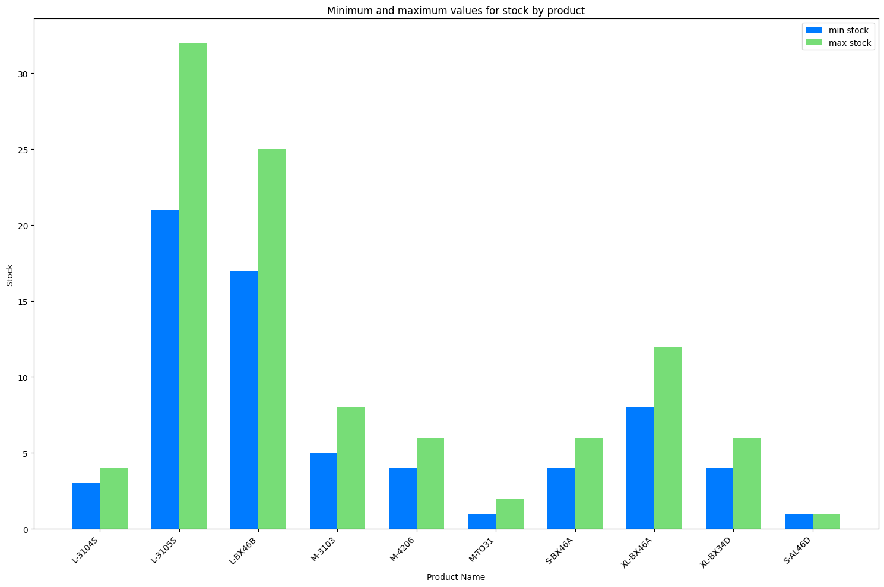
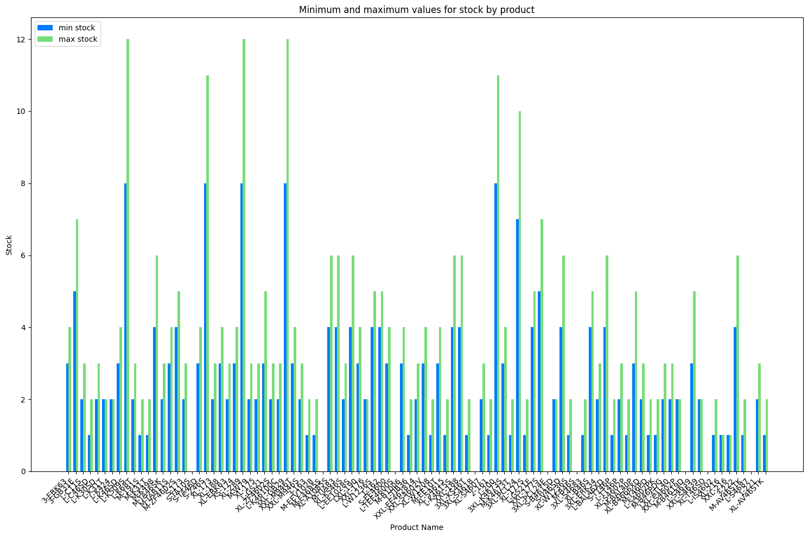

# UnderFit 

Final Proyect about retail at Ironhack. 

## Objetive 

The objective is to predict the demand for products in a shop to optimise inventory levels and reduce losses due to overstocking or out-of-stocks. In addition, to link the demand for these products with the optimisation of the distribution of these products in the warehouse to optimise the preparation/stocking time and maximise sales. 

**Use Cases**

- Improve stock management.
- Reduce losses due to unsold products.
- Enhance warehouse efficiency.
- Increase the average customer ticket. 
- Building customer loyalty. 

## Data Sources

Entity-relationship diagram:

In total, is composed of:

- 225 customers
- 4169 products
- 2286 orders
- 105757 sold products
- €3950215 total sales
- From 2003 to 2006 order dates

## Insights

**Customer Analysis**

- Most customers are from Russia, with 27.6% located in Moscow.
- Over 80% of customers are continuous buyers, indicating strong customer trust.
- Customer acquisition is mainly through advertisements, calls, and visits.
- Customers are primarily retailers or small-scale wholesalers.
- The average number of orders by customer is 10. 

**Delay Payments**

- Customers take an average of 4 days to pay.
- No correlation between sales amount and payment delay.
- Customers who pay in advance tend to spend more, especially when compared to those with delays over 30 days.
- Characteristics of customers with delayed payments:
    - Region: Moscow
    - Price Category: 1
    - Customer Class: Large-Scale Wholesaler-1
    - Lead Source: Referral by the Central Office
    - Discontinued: No
- Sales peaks often coincide with increased payment delays.

**DeliveryTime**

- The average delivery time is 0, indicating an efficient supply chain.
- No significant patterns detected based on the mode of transport.

**Sales**

- Highest sales occur in Moscow.
- Strong correlation between total sales and the number of orders by customer.
- Customers place an average of 10 orders.
- The most profitable customer acquisition source is *Referal by Central Office*.
- Delivery cost accounts for less than 5% of total sales.
- **Total Sales**: €3,953,248.07
- **Top Revenue-Generating Product Categories:**
    - Briefs
    - Drawers
- **Top-Selling Products:**
    - The most sold products are also the highest revenue generators.
- **Highest Profit Margin Categories:**
    - *Cuff-Over the Calf* (43.57%) -> Least sold (only in winter)
    - *Regular-Over the Calf* (43.07%) -> but just have 3100 sales
    - *Thongs* (35.29%) and *Undershirts* (35.21%) -> High Sales & profitability.

- **Products with Negative Margins (Should Be Discontinued)**:

|Product Name | Category | Profit Margin (%)|
|-------------|----------|------------------|
|L-K40  |	Briefs  |	-0.100610 |
|	L-BX64P	| Boxers |	-0.066667 |

- **Products with highest Profit Margin**

|Product Name | Category | Profit Margin (%)|
|-------------|----------|------------------|
| S-TIEE03S  |	Thongs  |	2.225000% |
|	M-EE1206	| Briefs |	2.190476% |

- **Size Analysis:**
    - Best-selling sizes: *XL*, *L* and *M*.

**Time trends**

- Sales peak in **August-Spetember** and **February-March**, likely due to back-to-school season and colder months in Russia.

- **Day of the Week Analysis:**
    - Highest sales occur on **Friday, Tuesday and Monday**.
    - Sales drop significantly in **May and June** accross all weekedays.

**Stock**

- Stockout rates: 0%

**Payment Methods**

- Popular payment method : *Cash*

## Forecasting

### Total sales forecasting

**Objective**: Predict weekly total sales. 

**Process:**

1. Group data by week.
2. Substitute outliers by median.
3. Check for normality and apply Box-Cox
4. Time series descomposition.
5. Series Stationarity test. 
6. Autocorrelation plots for original and differential series
7. Apply models:
    - Auto arima -> Poor performance
    - SARIMAX
    - Prophet -> Best model

8. Residuals study
    
**Model Comparison:**

| Models | AIC | BIC | HQIC | Log Likelihood |
|-----------|-----------|-----------|-----------|-----------|
|  **SARIMAX** | 627.366  | 637.944 | 631.651 | -309.683 |
|  **ARIMA** | 631.015 | 646.823 | 637.418 | -309.507 |
|  **Prophet** | 153.00211 | 164.909 |  |  |

**Best model: Prophet**

### Desagregate forecasting

- **Classification ABC**

    The ABC criterion is based on the contribution of each product to total revenues:

    - Class A: Represent 60% of revenues.
    - Class B: Represent 30% of revenues.
    - Class C: Represent the remaining 10%.

- **According to the demand**

    Now that we have the ABC classification, we will categorise the products according to their demand: **high or low**. 

    Products with less than 10 units (*median*) of monthly demand or with more than 30% of months without sales will be classified as low demand.

| Classification / Demand | A| B  | C | 
|-----------|-----------|-----------|-----------|
|  High Demand | 438  | 928 | 827 | 
|Low Demand  | 11 | 497 | 1340|

Following 20-80 rules, we predict 20 products of each classification:

For forecasting:
- **High demand products** -> Same method as total sales forescasting.
- **Low demand products** -> Moving Average.

- Class A, High Demand

- Class B, High Demand

- Class C, High Demand

- Class A, Low Demand

- Class B, Low Demand

- Class C, Low Demand

#### Selection of **Class A products with High Demand**

Within the products classified as Class A with high demand, 4 products have been selected to calculate all metrics related to inventory management and forecast stock-outs. These metrics are calculated under a 99% confidence level, which means that we want to be 99% sure that the inventory level will be sufficient to meet the demand.

##### **Calculated metrics**

1. **Security Stock**

Security stock is the additional amount of inventory held to cover uncertainty in demand or delivery times. It is calculated using the following formula:

$\text{Security Stock} = \( Z \times \sigma_{LT} \)$

where: 

- $Z$ is the value corresponding to the 99% confidence level (approximately 2.33 in a normal distribution).
- $\sigma_{LT}$ is the standard deviation of the lead time, which takes into account the variability of both demand and lead time.

To calculate $\sigma_{LT}$, we use the following formula:

$\sigma_{LT} = \sqrt{\left(LT_{avg} \times \sigma_{demand}^2 \right) + \left( \mu_{demand}^2 \times LT_{std}^2 \right)}$

where:

- $LT_{avg}$ is the average lead time.
- $\sigma_{demand}$ is the standard deviation of demand. 
- $\mu_{demand}$ is the average demand.
- $LT_{std}$ is the standard deviation of demand.

2. **Reorder Point (ROP)**

The Reorder Point (ROP) is the level of inventory at which an order must be placed to avoid running out of stock. It is calculated using the formula:

$\text{ROP}: \mu_{demand} \times LT_{avg} + \text{Security Stock}$

where:

- $\mu_{demand}$ is the average demand during the lead time.
- $LT_{avg}$ is the average lead time.
- **Security Stock** is the adicional inventory calculated previously.

3. **Lead Time**

Lead time is the time that elapses from the time an order is placed until the product arrives in inventory. This parameter is essential as it directly influences the calculation of ROP and security stock.

#### Products

| ProductID | Product Name | Category  | Lead time (avg) | Lead time (std) | ROP | Security Stock | Percentage profit |
|-----------|-----------|-----------|-----------|-------------|---------|-------------|--------------|
|  427 | *M-ERK61* | Briefs | 1.65 | 7.41 | 327.02 | 298.72 | 21.62% |
|  861  | *XL-K4673* | Briefs | 0.23 | 1.45 | 39.14 | 36.71 | 27.95% |
|  865  | *XL-K465* | Briefs | 0.29 | 1.69 | 61.05 | 56.88 | 24.69% |
|  830  | *XL-K29* | Briefs | 0.32 | 1.70 | 55.47 | 51.50 | 26.905% | 

## Distribution in the warehouse

To efficiently organize product storage, clustering analysis was performed:

- **Category-level clustering:** Identifies groups of similar product categories based on demand and sales behavior.

- **Product-level clustering:** Within each category, products were further grouped based on purchase likelihood, ensuring that frequently bought-together items are stored close to each other (using *apriori*).

Looking at the above graph of the elbow method, we determine that the optimal k is 4

**PCA Analysis Interpretation:**

- **PCA1** → Represents fabric quantity (Negative: Less fabric, Positive: More fabric).

- **PCA2** → Represents gender (Negative: Masculine, Positive: Feminine).

By leveraging these insights, warehouse efficiency improves by minimizing retrieval times and optimizing inventory placement.

In conclusion, this organization minimizes the time needed for order picking and replenishment.

### Minimization Problem: Optimizing Product Retrieval

To further improve efficiency, we formulated an optimization problem to minimize the total distance required to retrieve products from the warehouse. The objective is to determine the shortest possible route for picking the required products while maintaining stock levels.

#### **Formulation**
The minimization problem is structured as follows:

**Decision Variables:**

- $x_{ij}$: Binary variable to indicating if the route goes from product $i$ to product $j$. 

**Objetive Function:**

$\min{\sum_{i\neq j}} d_{ij} x_{ij}$

where: 
- $d_{ij}$ is the Euclidean distance between products $i$ and $j$.

**Constrains:**
1. Each product must be visited exactly once: $\sum_{j} x_{ij}, \forall i$
2. Each product must be left exactly once: $\sum_{i} x_{ij}, \forall j$
3. No direct backtracking to the same location: $x_{ij} + x_{ji} \leq 1, \forall i \neq j$

Using this optimization model, the system calculates the most efficient retrieval route, reducing picking time and improving overall warehouse performance. The method ensures that products are retrieved in the most time-effective manner, leading to a smoother inventory flow.

## Recommendation System

The recommendation system consists of two components, designed to enhance the customer experience and increase sales by providing personalized suggestions based on product similarity, customer purchase history, and association rules for frequently bought together products.

1. **Customer Purchase History-Based Recommendations**

This part of the recommendation system suggests products to customers based on their past purchase behavior. It uses a **customer-product matrix** to identify products frequently bought by the customer and recommends them.

2. **Product Similarity-Based Recommendations**

This part of the system recommends products based on their similarity to the ones selected by the customer. It uses Cosine Similarity to measure how similar products are in terms of features such as *category, product line, size, weight, gender, pack size and price*.

### System Benefits

- **Personalized Recommendations:** The system tailors product suggestions based on both customer behavior and product similarity, improving the customer shopping experience.

- **Increased Sales:** By recommending related products, both similar and complementary, the system encourages customers to purchase additional items, increasing the average order value.

- **Customer Retention:** Personalized recommendations based on historical purchases and similar product suggestions help build customer loyalty and improve retention rates.

## Streamlit Application Overview

This project includes an interactive Streamlit dashboard that allows you to explore different aspects of the system. It provides real-time insights into product availability, recommendations, stock levels, and optimized retrieval paths for warehouse management. The dashboard consists of four main tabs:

1. **Home:** 
    The landing page of the application, offering an introduction to the project's objectives and features.

2. **Pick-up Products:**
    Here, you can input the products you want to pick up and specify the quantities. The application will check if those products are available, display their locations in the warehouse, and calculate the most efficient retrieval route.

3. **Product Location Finder:**
    This tab allows you to input product names to see where they are located in the warehouse.

4. **Product Recommendations:**
    Based on your selection, the system recommends products in two different ways:
        - Customer History-based: Suggest products frequently bought by the customer.
        - Product Similarity-based: Suggest similar products using cosine similarity.

5. **Product Replenishment Check:**
    This tab checks if there is enough stock for a given product and whether the product has crossed the trigger point for replenishment. Additionally, it provides the security stock, reorder point (ROP), and lead time for that product.

## PowerBI

## Process

### 1. Cleaning

- *8/2/2025*.
    -  Eliminación de los valores nulos en todos los datasets a excepción de `inventory_transactions` porque al tener tantos valores nulos, quizas pierdo mucha cantidad de ellos. Los valores nulos que tienen son en la cantidad comprada o perdida y muchos de ellos coinciden con los que no tienen registros de compra. 
    - Unión de datasets como: `Payment Methods` y `Payments`, `Suppliers`y `Purchase Orders` 

### 2. EDA

- *11/2/2025*.
    - **Estudio clientes.** Demográfico, por ventas, y por fuente de captación. Número de pedidos
    - **Estudio productos.** Productos y categorías más rentables. Relación costo de envío y el total de ventas por cliente. 
    - **Estudio ventas.** Total ventas, por categoría. Análisis de venta por tamaño (talla). 

- *13/02/2025*
    - **Estudio de pagos de clientes**. El retraso de pago se ha calculado como Payment Date - Order Date 
    Podemos observar que la media de días de retraso de pago es 1.73 días. Además, en media los clientes que pagan anticipadamente gastan más que los que pagan a dias posteriores. 

        **Realizado**
  
        - Análisis de los dias de retraso de pago
        - Análisis del tiempo de entrega
        - Análisis del número de ofertas por cliente
        - Análisis del número de ofertas/ tiempo
        - Mapa de calor de pedidos por dia y mes
        - Metodos de pago

- *15/02/2025*

    **Realizado**

    - Análisis de stock --> hecho
    - Estudio del empleado
    - Análisis de los proveedores
    - Análisis más exaustivo de los productos
    - Tendecia de la compra de diversos productos por estación --> tipo en febrero se compran más cosas de invierno
    

### 3. Forecasting
- *18/02/2025*

    - series temporales
        - ventas totales
        - por categoria
        - stock

- *22/02/2025*

    - series temporales de las ventas totales con distintos metodos
    - series temporales desagregadas 

- *25/02/2025*

    - escoger dos productos de la classification a high demand: 
        - estudiar lead tiem de cada uno de ellos order date..
        - hacer la prevision stock.........

- *27/02/2025*  

    - sacar previsiones max/min de cada producto de las clasificaciones ABC - baja/alta demanda
    - implementacion de las funciones para security_stock
        - aplicadas a dos productos de high-demand-class-a, donde se ha sacado: lead_time (avg y std), trigger-point, ROP, security-stock

- *01/03/2025*  

    - distribucion del inventario
    - problema de minimizacion
    - implementacion de streamlit
    - powerbi

- *04/03/2025*

    - terminar pestaña powerbi
    - presentacion

### 4. Visualization

## Time Line

| Tuesday | Thursday | Saturday |
|-----------|-----------|-----------|
| 4 - Incio  | 6 - Búsqueda dataset  | 8 - Limpieza   |
| 11 - EDA   | 13 - EDA   | 15 - EDA    |
| 18 - Forecast  | 20 - Forecast | 22 - Forecast |
| 25 - Forecast  | 27 - Forecast  | 1 -  Distribution in the warehouse |
| 4 - terminar powerbi + presentacion  | 6 - presentacion   | 8 - preparar presentacion  |
| 11 - **Presentacion**  | 13 - **Presentacion**  | 15 - **Presentacion**  |

## Project Structure 📁
- `datasets/`: contains all clean and original datasets used in this proyect
- `EDA/`:
    - `cleaning.ipynb`: jupyter notebook use to clean data
    - `eda.ipynb`: jupyter notebook use to do eda
    - `aux_functions.py`: python file where are useful functions were used in other jupyter notebooks

